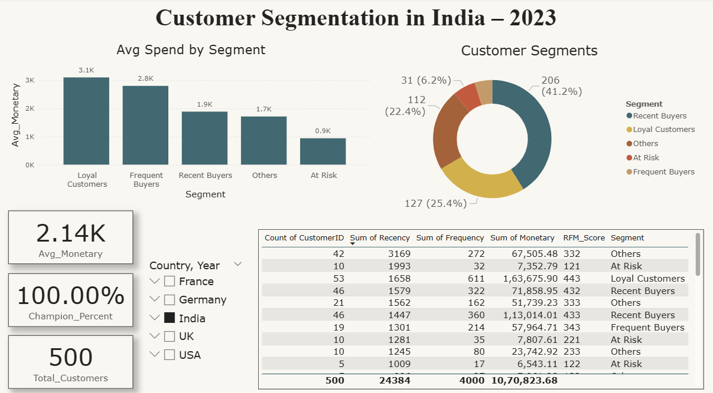

# 📊 Customer Segmentation with RFM Analysis

This Power BI project segments customers based on Recency, Frequency, and Monetary (RFM) values. It helps businesses better understand customer behavior and target marketing strategies by identifying key segments like Champions, Loyal Customers, At Risk, and more.

---

## 🎯 Objectives

- Identify high-value customers
- Detect at-risk customers for re-engagement
- Visualize customer distribution by RFM metrics
- Support data-driven decision-making with KPIs

---

## 🧠 What is RFM?

- **Recency**: How recently a customer made a purchase
- **Frequency**: How often a customer makes a purchase
- **Monetary**: How much money a customer spends

RFM Analysis scores each customer and groups them into actionable segments like:
- 🟢 Champions
- 🟠 Loyal Customers
- 🔴 At Risk
- 🟡 Recent Buyers, etc.

---

## 🔧 Key Features

- 📈 **Custom DAX Measures** for:
  - Recency, Frequency, Monetary
  - RFM Score (e.g., 555)
  - Segment assignment
  - % of Champions
- 📊 **Visualizations**:
  - Donut Chart: Segment Distribution
  - Clustered Bar Chart: Segment vs Avg. Monetary
  - Table View: RFM Metrics per Customer
  - KPI Cards: Total Customers, Avg. Spend, Champion %
- 📅 Date-based Filters
- 🎯 Dynamic Title 
- 📎 Clean and Modern UI with theme customization

---

## 🛠 Tools Used

- **Power BI Desktop**
- **DAX** for custom calculations
- **Excel/CSV** (mock transaction data)

---

## 🧪 KPIs Calculated

- **Total Customers**
- **Average Monetary Value**
- **% of Champions**

---

## 📸 Dashboard Preview

---

## 👩‍💻 Author

**Priti Singh**

## 📜 License

This project is licensed under the [MIT License](LICENSE).  
You are free to use, adapt, and share it with proper attribution.
